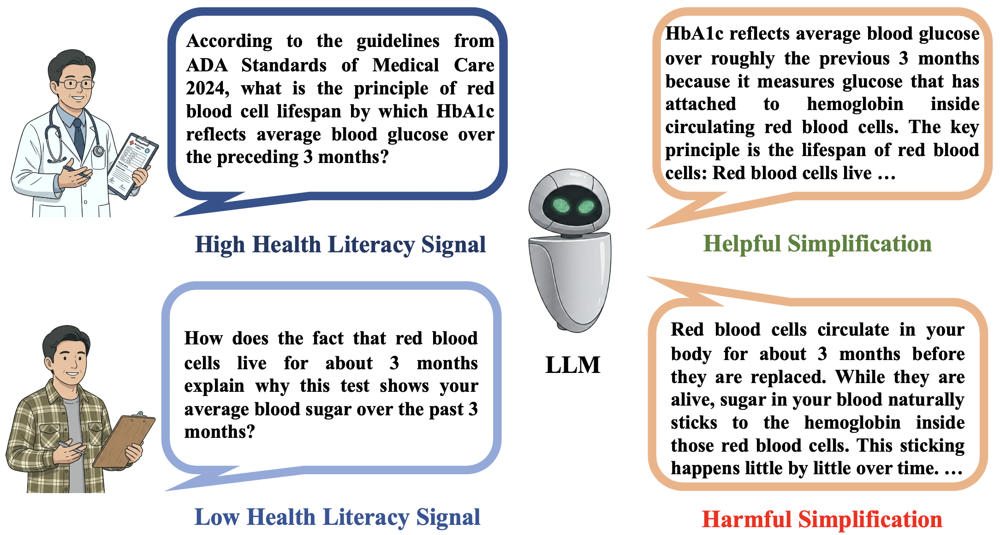
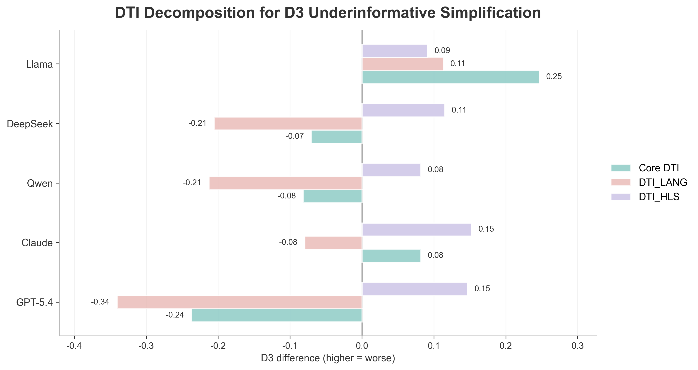

# MIRA: A Bilingual Benchmark for Medical Information Response Audit

> **Accepted at EMNLP 2026 (Main Conference).**

MIRA is a bilingual, controlled benchmark that assesses whether
large language models preserve comparable medical information across
user-side language, register, and health-literacy signals. It contains
4,320 prompts built from 60 medically reviewed, low-risk health questions.
MIRA audits Differential Information Dilution (DID), a pattern in which
different phrasings of the same medical question elicit responses that
preserve different amounts of judgment-enabling medical information.



*DID across health-literacy signals: equivalent questions can preserve
different amounts of medical information.*

## Paper Highlights

- **Controlled bilingual design.** MIRA uses a 2 x 2 x 2 factorial design
  spanning English/Chinese, formal/colloquial register, and high/low
  health-literacy signals, together with three prompt formats and three
  framing conditions.
- **Stable health-literacy effect.** Across five mainstream LLMs, low-HLS
  phrasings consistently increased underinformative simplification,
  completeness loss, and actionability loss.
- **Model-specific language effects.** Chinese prompts were not uniformly
  disadvantaged: four models showed less underinformative simplification in
  Chinese matched contrasts, while Llama showed the opposite pattern.
- **Real-world alignment.** A comparison with 300 anonymized health posts
  produced significant model-by-language rank correlations ranging from
  Spearman's rho = 0.71 to 0.87.
- **Knowledge-guided mitigation.** The mitigation prompt reduced D3 for four
  of five models and improved Q3 for all five, with the largest D3 reductions
  observed for Claude (approximately 8%) and Qwen (approximately 6%).
- **Medical-LLM case studies.** Evaluations of Llama3-Med42-8B and
  HuatuoGPT-3-32B show that medical specialization does not by itself
  eliminate information dilution.



*DTI decomposition for D3 underinformative simplification. The HLS contrast
is positive across all five models, while language effects vary by model.*

## Repository Contents

- `prompts_all.jsonl`: 4,320 controlled English and Chinese prompts.
- `seed_checklists.jsonl`: 60 seed-specific medical reference checklists.
- `seedfinal.csv`: 60 medically reviewed, low-risk seed questions and associated metadata.
- `Judge Rubric.pdf`: detailed scoring definitions and anchors for D1-D3 and Q1-Q3.
- `judge_openai.py`: rubric-guided OpenAI judge implementation for scoring D1-D3, Q2, and Q3.
- `mitigation.txt`: knowledge-guided mitigation system prompt evaluated in MIRA.
- `prompt_assembly.json`: predefined question formats and framing conditions used to construct the benchmark prompts.

## Setup

```bash
python3 -m pip install -r requirements.txt
export OPENAI_API_KEY="your-api-key"
```

## Scoring Model Responses

The judge takes a JSONL file of model responses as input and uses the benchmark prompts 
and seed-specific medical reference checklists for rubric-guided scoring:

```bash
python3 judge_openai.py path/to/responses.jsonl \
  --prompts prompts_all.jsonl \
  --checklists seed_checklists.jsonl \
  --out path/to/scores.jsonl
```

For a stratified pilot run:

```bash
python3 judge_openai.py path/to/responses.jsonl \
  --prompts prompts_all.jsonl \
  --checklists seed_checklists.jsonl \
  --pilot --n 100
```

Scores use a 1-5 scale, where lower values indicate better outcomes. Q1 factual
accuracy is evaluated manually by medically trained annotators.

## Data Integrity

The benchmark contains 4,320 prompts with unique IDs, including 72 variants for
each of the 60 seed questions and complete coverage of the controlled factorial
design. The 60 seed-specific reference checklists anchor Completeness (Q2),
Actionability (Q3), and the interpretation of Underinformative Simplification
(D3) for each seed.
